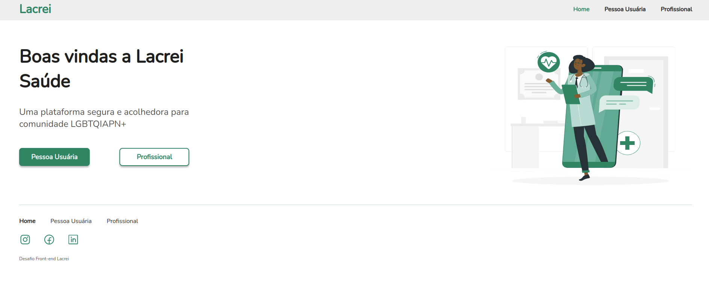

<h1 align="center">Desafio Lacrei</h1>

✅ Como rodar a aplicação


### 🎲 Rodando a aplicação

```bash
# Clone este repositório
$ git clone <https://github.com/Brunno-costa27/desafio-lacrei.git>

# Acesse a pasta do projeto no terminal
$ cd desafio-lacrei

# Instale as dependências
$ npm install

# Execute a aplicação
$ npm run dev

# O servidor inciará na porta:5173 - acesse <http://localhost:5173>

```

✅ Tecnologias utilizadas

### 🛠 Tecnologias

As seguintes ferramentas foram usadas na construção do projeto:

- [React](https://pt-br.reactjs.org/)
